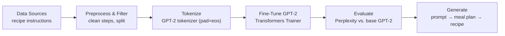

<div align="center">
  
# 🥗 **Plan2Plate — GPT-2 Recipe & Meal-Plan Generator**


A minimal, production-ready pipeline to **fine-tune GPT-2 on recipe data** and generate **meal plans + step-by-step recipes** from a prompt.

</div>

---

## 🧭 Abstract
**Plan2Plate** fine-tunes **GPT-2** on concise cooking instructions and pairs it with a lightweight, prompt-driven flow to produce **daily meal plans** and **detailed recipes**. The project is intentionally minimal: clean data, train, evaluate, and generate—fast to reproduce and easy to extend.

---

## 🔎 Overview
- **Model**: GPT-2 fine-tuned for recipe text (imperative, succinct steps).
- **Dataset**: recipe instructions (public corpus).
- **Flow**: 
  1) estimate/choose calorie target → 
  2) propose a day plan (breakfast/lunch/dinner) → 
  3) generate the full recipe for the chosen item with the fine-tuned model.
- **Evaluation**: simple perplexity (base vs. fine-tuned) and qualitative checks.
- **Use cases**: teaching, demos, or quick experiments in recipe generation.

---

## 🧪 Pipeline



---

## 📦 Data
- Uses concise **cooking instructions** (short, imperative recipe steps).
- Tokenization: GPT-2 tokenizer with `pad_token = eos_token` for clean training batches.
- You can swap in your own recipe corpus—keep the format “instructional lines” for best results.

> Tip: Tiny, clean instruction lines fine-tune faster and generalize better than long stories.

---

## 📈 Results
- **Perplexity** improves on held-out recipe instructions after fine-tuning (lower is better).
- **Qualitative**: more coherent, action-oriented steps; better on-topic generation (vs. base GPT-2).

> Reproduce your own numbers with the training snippet below, then run the eval cell to compare.

---
## 🤗 Pretrained Model (Hugging Face)

[](https://huggingface.co/anf1lll/gpt2-model)

The fine-tuned **Plan2Plate** model is publicly available on the Hugging Face Hub:

- Model ID: `anf1lll/gpt2-model`
- Hosted at: https://huggingface.co/anf1lll/gpt2-model


## ⚙️ Installation

```bash
git clone https://github.com/AnfalAlkuraydis/Plan2Plate.git
cd Plan2Plate

# base deps
pip install -U torch transformers datasets accelerate huggingface_hub ipywidgets matplotlib
```

<div align="center">
Made with ❤️ — fine-tuning tiny LMs for tasty outputs.
</div>
