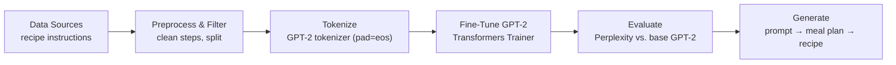

<div align="center">
  
# 🥗 **Plan2Plate — GPT-2 Recipe & Meal-Plan Generator**


A minimal, production-ready pipeline to **fine-tune GPT-2 on recipe data** and generate **meal plans + step-by-step recipes** from a prompt.

</div>

---

## 🧭 Abstract
**Plan2Plate** fine-tunes **GPT-2** on concise cooking instructions and pairs it with a lightweight, prompt-driven flow to produce **daily meal plans** and **detailed recipes**. The project is intentionally minimal: clean data, train, evaluate, and generate—fast to reproduce and easy to extend.

---

## 🔎 Overview
- **Model**: GPT-2 fine-tuned for recipe text (imperative, succinct steps).
- **Dataset**: recipe instructions (public corpus).
- **Flow**: 
  1) estimate/choose calorie target → 
  2) propose a day plan (breakfast/lunch/dinner) → 
  3) generate the full recipe for the chosen item with the fine-tuned model.
- **Evaluation**: simple perplexity (base vs. fine-tuned) and qualitative checks.
- **Use cases**: teaching, demos, or quick experiments in recipe generation.

---

## 🧪 Pipeline



---

## 📦 Data
- Uses concise **cooking instructions** (short, imperative recipe steps).
- Tokenization: GPT-2 tokenizer with `pad_token = eos_token` for clean training batches.
- You can swap in your own recipe corpus—keep the format “instructional lines” for best results.

> Tip: Tiny, clean instruction lines fine-tune faster and generalize better than long stories.

---

## 📈 Results
- **Perplexity** improves on held-out recipe instructions after fine-tuning (lower is better).
- **Qualitative**: more coherent, action-oriented steps; better on-topic generation (vs. base GPT-2).

> Reproduce your own numbers with the training snippet below, then run the eval cell to compare.

---

## ⚙️ Installation

```bash
git clone https://github.com/AnfalAlkuraydis/Plan2Plate.git
cd Plan2Plate

# base deps
pip install -U torch transformers datasets accelerate huggingface_hub ipywidgets matplotlib
```

If you’re using Jupyter:
```bash
jupyter nbextension enable --py widgetsnbextension
```

---

## 🚀 Quickstart

### Generate with a fine-tuned model (from the Hub or your local weights)
```python
from transformers import AutoTokenizer, AutoModelForCausalLM
import torch

MODEL_ID = "anf1lll/gpt2-model"     # or path to your local fine-tuned checkpoint
tok = AutoTokenizer.from_pretrained(MODEL_ID)
tok.pad_token = tok.eos_token

model = AutoModelForCausalLM.from_pretrained(MODEL_ID)
model.eval()

prompt = "Plan a 2000 calorie day and give a dinner recipe for grilled chicken with sides."
inputs = tok(prompt, return_tensors="pt")
with torch.no_grad():
    out = model.generate(
        **inputs,
        max_length=220,
        temperature=0.9,
        top_p=0.95,
        do_sample=True,
        eos_token_id=tok.eos_token_id
    )
print(tok.decode(out[0], skip_special_tokens=True))
```

---

## 🏋️ Fine-Tuning (minimal)
```python
from datasets import load_dataset
from transformers import AutoTokenizer, AutoModelForCausalLM, Trainer, TrainingArguments
import math

dataset = load_dataset("darkraipro/recipe-instructions")  # replace with your dataset if needed
tok = AutoTokenizer.from_pretrained("gpt2")
tok.pad_token = tok.eos_token

def tokenize(ex):
    return tok(ex["text"], truncation=True, padding="max_length", max_length=128)

ds = dataset["train"].train_test_split(test_size=0.1, seed=42)
tok_ds = ds.map(tokenize, batched=True, remove_columns=ds["train"].column_names)
tok_ds.set_format(type="torch", columns=["input_ids", "attention_mask"])

model = AutoModelForCausalLM.from_pretrained("gpt2")

args = TrainingArguments(
    output_dir="out",
    per_device_train_batch_size=8,
    per_device_eval_batch_size=8,
    evaluation_strategy="epoch",
    save_strategy="epoch",
    learning_rate=5e-5,
    num_train_epochs=3,
    fp16=False,
    report_to="none",
)

trainer = Trainer(
    model=model,
    args=args,
    train_dataset=tok_ds["train"],
    eval_dataset=tok_ds["test"],
)

trainer.train()
metrics = trainer.evaluate()
perplexity = math.exp(metrics["eval_loss"])
print("Perplexity:", perplexity)

# save (local) or push to Hub
trainer.save_model("plan2plate-gpt2")
tok.save_pretrained("plan2plate-gpt2")
```

---

## 📁 Suggested Structure
```
Plan2Plate/
├─ src/                     # scripts / notebooks
├─ README.md                # this file
├─ requirements.txt
├─ LICENSE                  # MIT
└─ .gitignore
```

---

## 🛣️ Roadmap
- Optional nutrition-aware prompt templates (macros, allergens).
- Lightweight Gradio/Streamlit demo app.
- LoRA/QLoRA fine-tunes for faster training on low-VRAM GPUs.
- Guardrails for generation (length, ingredient constraints).

---

## 📜 License
This project is released under the **MIT License**.

---

<div align="center">
Made with ❤️ — fine-tuning tiny LMs for tasty outputs.
</div>
